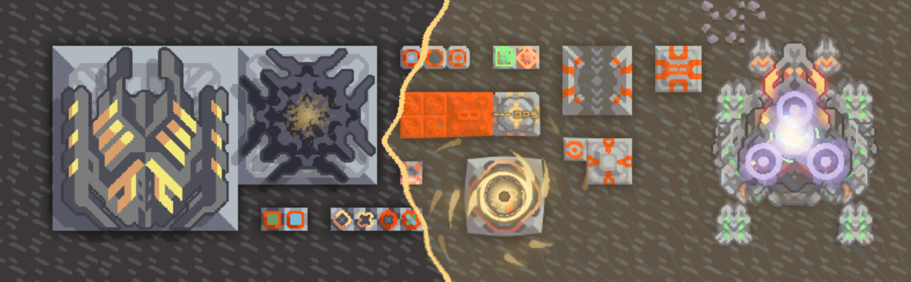

# Extra Sand in the Sandbox - Redux
The revival of my old v5 mod, [Extra Sand in the Sandbox](https://github.com/MEEPofFaith/extra-sand).
Many of the features in this mod were once in [MEEPscellaneous Concepts](https://github.com/MEEPofFaith/prog-mats-java) until I decided to split them off into their own mod.
However, this isn't just stuff from MC, there's also new stuff that didn't come from MC.

- Turrets
    - Evisceration - Delete everything in that general direction
    - Fantastic Turret - Randomly fires the bullets of all units and turrets. Fires stronger bullets the longer it fires, though the damage calculations are a bit scuffed are are not indicative of actual damage values.
        - Must be enabled in settings
- Items and Liquids
    - Several variations of item/liquid/both sources and voids.
- Power
    - Configurable Power Source - A power source whose power output can be configured.
    - Configurable Power Void - A power void whose power consumption can be configured.
    - Smart Power Source - The amount of power it outputs is equal to the power required by the network + 1000.
- Defense
    - Sandbox walls - Indestructible and can be configured to act like surge, plastanium, and phase walls, and test for DPS.
    - Target Dummy - Invincible dummy that can be toggled between ground and flying that records DPS.
- Heat
    - Configurable Heat Source - A heat source whose heat output can be configured.
- Storage
    - Configurable Container - A container with a configurable storage capacity
    - Configurable Battery - A battery with a configurable capacity
    - Configurable Capacity Configurer - Configures the capacity of configurable containers and batteries that pass through it
    - (Note: There is no configurable liquid container. This is because flow rate is based on the block's liquid capacity, which is not dynamic and I can't do anything about that.)
- Other
    - Configurable Mender -  A mender whose mending speed can be configured.
    - Configurable Overdriver - An overdriver whose overdrive amount can be configured.
    - Flowrate Void - A special void that records the flowrate of items, liquids, and payloads that are put into it as well as the status of the power grid it's connected to.
- Units
    - Fantastic Unit - Has every other unit's weapons and abilities attached to it.
        - Must be enabled in settings
